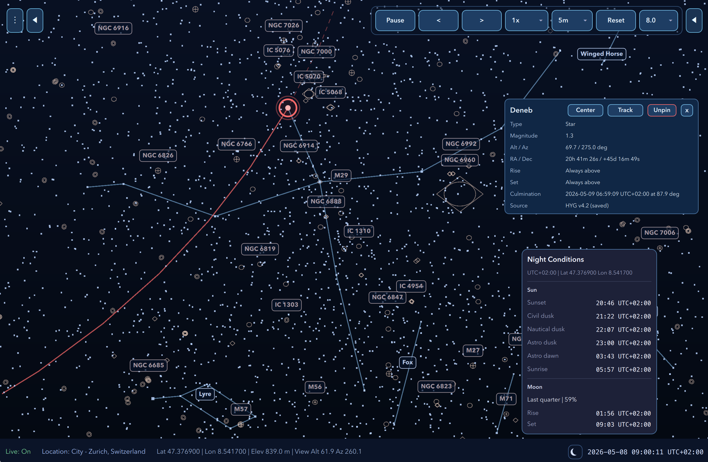

# SkyGate

[](https://github.com/saprykin/skygate/actions/workflows/ci.yml)
[](https://codecov.io/gh/saprykin/skygate)

**This project is fully vibecoded: every single line and image in the project
is generated by AI.**

SkyGate is an AI-built desktop application for exploring an interactive sky
view. It combines reusable projection math and ephemeris libraries with a Qt
Quick UI that renders stars, constellations, the horizon, and overlay labels.

<p align="center">
  
</p>

## Highlights

- Interactive sky map with pan, zoom, hover, and label overlays
- Bundled Messier deep-sky object markers with symbolic glyph rendering
- Time playback controls with pause, step, and speed adjustment
- Fixed UTC popup accepts BCE/BC dates using proleptic Gregorian years
- Multiple projections: `Stereographic`,
  `AzimuthalEquidistant`, and `Perspective`
- Observer location from current device, bundled city catalog, or
  custom coordinates
- Bundled starter catalog plus support for downloading HYG v4.2 stars,
  OpenNGC deep-sky objects, and Stellarium constellation data
- Persistent settings and cached catalog data between launches
- Configurable terminal/file logging with bounded rotating log files

Ancient dates are intended for exploratory viewing. The date input uses a
proleptic Gregorian calendar, and the current Sun, Moon, and planet formulas
are lightweight approximations around J2000 rather than historical-astronomy
grade ephemerides for the far past.

## Repository Layout

- `apps/skygate-ui`
  Qt Quick application shell, QML UI, scene graph rendering,
  settings, and catalog workflow
- `libs/skygate-core`
  Projection contracts, math helpers, viewport logic, and time abstractions
- `libs/skygate-ephemeris`
  Catalog parsing, celestial coordinate calculations, and sky
  snapshot generation
- `docs/ARCHITECTURE.md`
  Detailed architecture notes, runtime flow, and extension points

## Requirements

- CMake 3.24 or newer
- A C++20 compiler
- Qt 6.5 or newer with `Core`, `Gui`, `Qml`, `Quick`, `Network`, and `Test`
- `Qt Positioning` (optional, enables the `Current Device` location mode)
- Zlib
- vcpkg (recommended on Windows and macOS for the zlib dependency)

## Build

SkyGate uses standard CMake. Qt is resolved from your Qt installation, not from
vcpkg. If CMake cannot find Qt automatically, point `CMAKE_PREFIX_PATH` at your
Qt installation root such as `/path/to/Qt/6.x/<platform>`.

On Linux, install zlib from your system package manager. On Windows and macOS,
the recommended local workflow is to use the checked-in vcpkg presets so zlib is
provided by `vcpkg.json`:

```bash
export VCPKG_ROOT=/path/to/vcpkg
export CMAKE_PREFIX_PATH=/path/to/Qt/6.x/<platform>
```

Use the platform-specific presets below for Windows and macOS when possible.
The plain `cmake -S` example remains useful for custom setups where zlib is
already discoverable without vcpkg.

```bash
cmake -S . -B build \
  -DCMAKE_BUILD_TYPE=Debug \
  -DSKYGATE_BUILD_UI=ON \
  -DSKYGATE_BUILD_TESTS=ON \
  -DCMAKE_PREFIX_PATH=/path/to/Qt/6.x/<platform>

cmake --build build
```

To build the libraries and tests without the UI application:

```bash
cmake -S . -B build-core \
  -DCMAKE_BUILD_TYPE=Debug \
  -DSKYGATE_BUILD_UI=OFF \
  -DSKYGATE_BUILD_TESTS=ON \
  -DCMAKE_PREFIX_PATH=/path/to/Qt/6.x/<platform>

cmake --build build-core
```

## Run

With the UI enabled, the simplest way to launch the application is:

```bash
cmake --build build --target run-skygate-ui
```

On macOS, the build also produces an app bundle at:

```text
build/apps/skygate-ui/SkyGate.app
```

There is also a macOS convenience target that opens the bundle:

```bash
cmake --build build --target run-skygate-ui-bundle
```

On non-bundle platforms, the executable target is `skygate-ui` inside the build
tree.

### Logging

SkyGate logs warnings and errors to the terminal by default. File logging can be
enabled from Preferences, or at startup with command-line flags:

```bash
SkyGate --log-to-file --log-file /path/to/skygate.log
SkyGate --log-to-terminal
SkyGate --no-log-to-terminal
```

Environment overrides are also supported:

```bash
SKYGATE_LOG_OUTPUT=both SKYGATE_LOG_FILE=/path/to/skygate.log SkyGate
```

`SKYGATE_LOG_OUTPUT` accepts `terminal`, `file`, `both`, or `none`. File logs
append across launches and rotate at 5 MiB, keeping three backups.

## Test

All module tests are registered with CTest:

```bash
ctest --test-dir build --output-on-failure
```

This covers core projection and math tests, ephemeris numeric regressions,
catalog parsing and archive handling, catalog download/cache workflow tests,
UI controller/model tests, and a QML smoke test for the main application module.

With the included `ui-debug` preset build tree, the equivalent command is:

```bash
ctest --test-dir build-make/ui-debug --output-on-failure
```

Tests carry CTest labels such as `unit`, `integration`, `qml`, `perf`,
`platform`, and `slow`. Use `ctest --test-dir build-make/ui-debug -LE slow
--output-on-failure` for the default non-slow suite, or `ctest --test-dir
build-make/ui-debug -L slow --output-on-failure` for slow guard/rendering
coverage.

### Coverage

Coverage instrumentation is opt-in and does not affect normal builds. The
recommended local workflow uses the `core-coverage` preset, which builds the
non-UI libraries and tests with `SKYGATE_ENABLE_COVERAGE=ON`:

```bash
cmake --preset core-coverage
cmake --build --preset core-coverage
```

On AppleClang/Clang builds, CMake enables LLVM source coverage with
`-fprofile-instr-generate -fcoverage-mapping`. If `llvm-cov` and
`llvm-profdata` are discoverable, including through `xcrun` on macOS, the build
also provides report targets:

```bash
cmake --build --preset core-coverage-text
cmake --build --preset core-coverage-html
cmake --build --preset core-coverage-codecov
```

The text report is written to
`build-make/core-coverage/coverage/coverage.txt`, and the HTML report starts at
`build-make/core-coverage/coverage/html/index.html`. The Codecov report target
writes `coverage.lcov` for LLVM builds or `coverage.xml` for GCC builds under
the same coverage directory. Report targets run the registered CTest suite first
with `LLVM_PROFILE_FILE` set to collect raw profiles on LLVM builds.

Without presets, configure coverage explicitly:

```bash
cmake -S . -B build-coverage \
  -DCMAKE_BUILD_TYPE=Debug \
  -DSKYGATE_BUILD_UI=OFF \
  -DSKYGATE_BUILD_TESTS=ON \
  -DSKYGATE_ENABLE_COVERAGE=ON \
  -DCMAKE_PREFIX_PATH=/path/to/Qt/6.x/<platform>

cmake --build build-coverage --target skygate-coverage-html
```

GCC builds use `--coverage` instrumentation. If `gcovr` is installed locally,
the same `skygate-coverage-text`, `skygate-coverage-html`, and
`skygate-coverage-codecov` targets generate reports under the build tree. Local
coverage workflows do not require network access; GitHub Actions uploads the
Codecov report on non-PR coverage runs with GitHub OIDC authentication.

## CMake Presets

The repository includes `CMakePresets.json` with `core-debug`, `ui-debug`, and
`ui-run` presets, plus `core-coverage` report presets for opt-in coverage
builds. They keep a stable local workflow and use the existing
`build-make/<preset>` layout.

The shared preset file is portable and does not check in developer-specific Qt
or macOS SDK paths. For UI builds, make Qt discoverable through your local
environment before running `cmake --preset ui-debug`. A common macOS setup is:

```bash
export CMAKE_PREFIX_PATH="$HOME/Qt/6.x/macos"
cmake --preset ui-debug
```

If your machine needs a specific SDK override, set `CMAKE_OSX_SYSROOT` locally
in your shell or IDE configuration rather than editing the tracked presets.
`CMakeUserPresets.json` is also supported for local-only overrides and should
not be checked in.

Windows builds should use the vcpkg-backed presets. Install vcpkg, set
`VCPKG_ROOT`, make Qt and Ninja discoverable, then configure one of the Windows
presets:

```powershell
$env:VCPKG_ROOT = "C:\src\vcpkg"
cmake --preset ui-debug-windows-vcpkg
cmake --build --preset ui-debug-windows-vcpkg
```

The checked-in `vcpkg.json` manifest declares zlib, which is required for gzip
and ZIP catalog import. The Windows vcpkg presets use the `x64-windows` triplet
by default, so runtime DLLs from vcpkg are copied next to the build-tree
executable for `ui-run-windows-vcpkg` and are also collected during install and
package deployment.

macOS can use vcpkg for zlib the same way while keeping Qt outside vcpkg.
Install vcpkg, set `VCPKG_ROOT`, and point `CMAKE_PREFIX_PATH` at your normal
Qt installation:

```bash
export VCPKG_ROOT="$HOME/src/vcpkg"
export CMAKE_PREFIX_PATH="$HOME/Qt/6.x/macos"
cmake --preset ui-debug-macos-vcpkg
cmake --build --preset ui-debug-macos-vcpkg
```

The macOS vcpkg presets do not pin `VCPKG_TARGET_TRIPLET`; vcpkg will use its
native default. Set `VCPKG_DEFAULT_TRIPLET=arm64-osx` or
`VCPKG_DEFAULT_TRIPLET=x64-osx` in your environment if you need to force one.
Qt is still resolved through `CMAKE_PREFIX_PATH` or `Qt6_DIR`, not through the
manifest.

## Packaging

On macOS, a DMG packaging target is available when `macdeployqt` is installed
and discoverable:

```bash
cmake --build build --target package-skygate-ui-dmg
```

All platforms with UI builds get standard CMake install targets. On Windows,
the package target produces a WiX MSI installer when the WiX Toolset is
installed and discoverable by CPack. Build the release vcpkg package like this:

```powershell
cmake --preset ui-release-windows-vcpkg
cmake --build --preset ui-install-windows-vcpkg
cmake --build --preset ui-package-windows-vcpkg
```

The Windows package output is an `.msi` installer.

On Linux, build a release AppImage with:

```bash
export CMAKE_PREFIX_PATH=/path/to/Qt/6.x/gcc_64
./packaging/linux/build-appimage.sh
```

The script configures a release UI build, installs it into an AppDir, downloads
`linuxdeploy` plus the Qt plugin, bundles Qt/QML dependencies, and writes the
AppImage under `dist/`. It expects CMake, Ninja, curl, zlib development files,
standard Qt Linux build/runtime dependencies, and a Qt 6.5+ desktop install.
The manual `Package Linux`, `Package macOS`, and `Package Windows` GitHub
Actions workflows build the same AppImage, DMG, and Windows installer packages
as downloadable artifacts. Manual runs produce `latest-<sha>` artifacts, and
`v*` tags publish versioned AppImages, DMGs, and MSIs to GitHub Releases. See
[docs/RELEASE.md](docs/RELEASE.md) for the release checklist and
[CHANGELOG.md](CHANGELOG.md) for release notes.

On macOS with vcpkg-managed zlib:

```bash
cmake --preset ui-release-macos-vcpkg
cmake --build --preset ui-install-macos-vcpkg
cmake --build --preset ui-package-macos-vcpkg
```

The install/package flow uses Qt's QML deployment support, so the output
contains the application executable, Qt runtime files, QML modules/plugins, and
vcpkg runtime dependencies such as zlib.

Current macOS builds are not notarized. After installing SkyGate from the DMG,
macOS may block the app until the quarantine attribute is removed:

```bash
xattr -rc /Applications/SkyGate.app
```

## Notes

- The app works with the bundled catalog out of the box; network access is only
  required for external catalog and constellation downloads.
- Downloaded/imported star and deep-sky catalogs are cached across launches via
  `QSettings` and app-data cache files.
- Bundled Messier deep-sky object data and the downloadable OpenNGC preset use
  OpenNGC v20260307 by Mattia Verga, licensed under CC-BY-SA-4.0:
  https://github.com/mattiaverga/OpenNGC
- For a deeper code tour, see [docs/ARCHITECTURE.md](docs/ARCHITECTURE.md).
