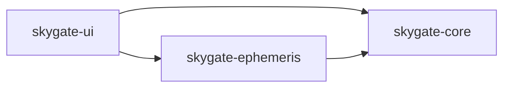

# Skygate Architecture

## Overview
Skygate is an in-process Qt 6 desktop application for rendering an interactive
sky view. The codebase is organized into three CMake modules with clear
dependency direction:

- `apps/skygate-ui`
  - Qt Quick application shell, QML views, presentation state, catalog
    download/import workflow, persistence, and scene-graph rendering.
- `libs/skygate-core`
  - UI-independent domain types, projection contracts, projection
    implementations, viewport math, and time abstractions.
- `libs/skygate-ephemeris`
  - Star catalog loading/parsing, catalog normalization, constellation data,
    astronomical coordinate calculation, and snapshot generation.

Dependency flow is one-way:

`skygate-core` is the lowest-level reusable library. `skygate-ephemeris` builds
on it. `skygate-ui` composes both and owns Qt-specific behavior.

## High-Level Runtime Flow
At startup, `apps/skygate-ui/src/main.cpp` creates a bundled star catalog,
constructs an ephemeris engine from that catalog, and wires the UI object graph:

1. `SkyContextController` owns the mutable application state exposed to QML.
2. `SkySceneModel` listens to the controller and derives renderable scene data.
3. `SkyViewportItem` consumes the scene model and renders the sky with Qt Quick
   scene graph nodes.
4. QML overlays and toolbars provide interaction, labels, preferences, and
   status surfaces around the custom viewport.

Normal frame production works like this:

1. User input, timer ticks, settings restore, location updates, or catalog
   changes mutate `SkyContextController`.
2. The controller emits `skyContextChanged()`.
3. `SkySceneModel` decides whether it must recompute an ephemeris snapshot,
   rebuild projected render data, or both.
4. `SkyRenderFrameBuilder` converts snapshot data into render points, lines,
   symbolic deep-sky glyphs, and overlay labels.
5. `SkyViewportItem` copies the derived frame into render data and rebuilds
   batched `QSGNode` geometry.
6. QML overlay components render hover labels and scene annotations on top of
   the viewport.

## Module Details

### `skygate-ui`
This module is the application layer and the most stateful part of the system.

#### Main presentation objects
- `SkyContextController`
  - Primary QML-facing controller (`QObject` with `Q_PROPERTY` and
    `Q_INVOKABLE` API).
  - Owns the current `skygate::core::SkyContext`, projection selection, view
    center/FOV, playback state, timeline settings, location source selection,
    and location status.
  - Owns `SkySettingsStore`, `SkyCatalogManager`, and the bundled city catalog
    model used by Preferences.
  - Owns `SkyTimeController`, the QML-facing date/time surface for display
    timezone selection, civil-time formatting, and fixed-time entry.
  - Uses a `QTimer` for live timeline updates.
  - Optionally requests a one-shot observer location update through Qt
    Positioning when the persisted location source is `Current Device`.
  - Loads persisted settings and restored catalog cache during initialization.
- `SkySceneModel`
  - Read-model / derived-state layer between controller state and rendering.
  - Listens to `SkyContextController::skyContextChanged()`.
  - Produces:
    - cached `skygate::ephemeris::SkySnapshot`
    - cached `skygate::core::PreparedProjection`
    - `SkyRenderFrame` with projected points, constellation segments,
      deep-sky glyphs, and labels
    - `overlayItems` for QML overlays
  - Also builds a spatial hover lookup for hit-testing object labels.
- `SkyViewportItem`
  - Custom `QQuickItem` responsible for drawing the sky in the Qt scene graph.
  - Renders:
    - projected celestial points
    - symbolic Messier deep-sky glyphs
    - projected constellation segments
    - horizon line
    - altitude/azimuth grid
    - highlighted cardinal azimuth lines
  - Uses a mutex-protected shared render-data snapshot to bridge scene-model
    data into `updatePaintNode()`.

#### QML composition
`apps/skygate-ui/Main.qml` composes several layers:

- `SkyViewportItem`
  - Base rendered star field and line work.
- `SkyInteractionLayer`
  - Mouse drag pan, wheel or pinch zoom, and hover hit-testing.
- `SkyOverlayLayer`
  - Text labels for objects and cardinal directions, plus collision avoidance
    with the timeline toolbar.
- `TimelineToolbar`
  - Playback, stepping, speed, magnitude cutoff, and view reset controls.
- `PreferencesWindow`
  - Observer location, projection, and catalog management UI.
  - Uses `PreferencesDraft.qml` as a staged edit buffer before applying changes
    back to `SkyContextController`.
  - Includes a source-aware location workflow with `Current Device`, `City`,
    and `Custom` modes plus a searchable city picker backed by the bundled
    catalog model.
- `StatusFooter`
  - Current context and catalog status summary.
  - Hosts the clickable selected-timezone text that opens the compact
    fixed-time popup.

This is intentionally a hybrid UI architecture: heavy drawing happens in C++
scene graph code, while transient UI and chrome stay in QML.

#### Catalog and settings subsystem
- `SkyCatalogManager`
  - Owns the active `IStarCatalog`, `IEphemerisEngine`, current catalog source
    metadata, cached constellation references, and revision counter.
  - Restores and persists catalog cache through `SkySettingsStore`.
  - Rebuilds the ephemeris engine whenever the catalog changes.
- `CatalogCoordinator`
  - Orchestrates the download and parse workflow.
  - Separates transport concerns from parse concerns.
- `CatalogDownloadService`
  - Tries multiple URLs until the first successful download.
  - Applies request headers, timeout, and maximum payload size checks.
- `CatalogPayloadParseService`
  - Parses downloaded payloads on `QThreadPool::globalInstance()`.
  - Marshals progress and completion callbacks back onto the UI thread.
- `SkySettingsStore`
  - Persists controller state in `QSettings`.
  - Persists location source and selected city id alongside raw observer
    coordinates so device/city/custom modes survive relaunch.
  - Persists the selected display timezone as an IANA timezone id; UTC remains
    the internal calculation and storage time basis.
  - Persists downloaded/imported catalog rows in an app-data cache file and
    stores related metadata in `QSettings`.
- `LocationCatalogModel`
  - Loads a bundled CSV of major cities from Qt resources.
  - Exposes a flat, filterable `QAbstractListModel` with country headers and
    city rows for the Preferences location picker.
- `TimeZoneCatalogModel`
  - Uses Qt's timezone database to expose a searchable IANA timezone list for
    Preferences.

### `skygate-core`
This module provides stable, UI-independent core types and projection logic.

#### Core types
- `GeoLocation`
- `UtcTimePoint`
- `EquatorialCoordinate`
- `HorizontalCoordinate`
- `SkyContext`
- `ProjectionType`
- `ProjectionParams`
- `ScreenPoint`

These types are intentionally small value types so they can move cheaply across
module boundaries.

#### Projection subsystem
- `IProjection`
  - Runtime strategy interface for projections.
- `createProjection(ProjectionType)`
  - Factory for selecting a concrete projection implementation.
- Concrete strategies:
  - `StereographicProjection`
  - `AzimuthalEquidistantProjection`
  - `PerspectiveProjection`
- `PreparedProjection`
  - Per-frame precomputation object used by the render path.
  - Stores the normalized center basis and projection-specific constants so
    large render passes do not repeat setup work for every star.
- `ProjectionAlgorithms`
  - Internal implementation shared by direct projection strategies and
    `PreparedProjection`, so projection formulas have one behavioral source.
- `ProjectionPipeline`
  - Internal helper for turning normalized projection results into
    `ScreenPoint` status and viewport coordinates.
- Focused geometry helpers
  - `Geometry2d` for primitive 2D math, rectangles, and line segments.
  - `SpatialIndex2d` for screen-space rectangle/circle indexes.
  - `LinePattern` for dash generation.
  - `ProjectedPolylineBuilder` for projection-aware polyline splitting.
- `SphericalGeometry`
  - Core spherical/vector helpers shared by projection and ephemeris code.

`PreparedProjection` is the preferred high-throughput path in the current UI.
The `IProjection` strategies still exist as a clean abstraction boundary and are
used by the controller for projection selection and sample output.

#### Time abstraction
- `ITimeSource`
  - Small interface used to make time acquisition replaceable and testable.
- `SystemTimeSource`
  - Default production implementation.

### `skygate-ephemeris`
This module owns celestial body metadata, catalog parsing, and runtime sky
computation.

#### Catalog model
- `IStarCatalog`
  - Abstract read-only catalog interface.
- `InMemoryStarCatalog`
  - Current concrete catalog implementation backed by a `std::vector`.
- `CelestialBody`
  - Body metadata, type, magnitude, optional fixed equatorial coordinates, and
    optional deep-sky metadata for Messier objects.
- `CelestialBodyEphemerisSource`
  - Explicit dispatch key describing how runtime coordinates should be
    produced.

#### Snapshot model
- `IEphemerisEngine`
  - Computes a `SkySnapshot` from a `core::SkyContext`.
- `SkySnapshot`
  - Current context
  - shared immutable catalog body vector
  - per-frame body states that reference catalog bodies by index

This immutable/shared snapshot shape avoids copying full body metadata into each
frame and keeps rendering decoupled from catalog ownership.

#### Engine implementation
The current engine is `SimpleEphemerisEngine`, created through
`createEphemerisEngine(...)`.

Its responsibilities are:

- keep an immutable copy of the current catalog bodies
- dispatch coordinate generation by `CelestialBodyEphemerisSource`
- delegate to focused calculators/lookups:
  - `SunEquatorialCalculator`
  - `MoonEquatorialCalculator`
  - `PlanetEquatorialCalculator`
  - `StarEquatorialCalculator`
- convert equatorial coordinates to horizontal coordinates via
  `CoordinateTransform`

#### Catalog ingestion pipeline
Catalog import supports multiple payload shapes:

- bundled starter rows
- bundled Messier deep-sky objects derived from OpenNGC
- saved pipe-row cache format
- HYG CSV
- gzip-compressed HYG CSV
- zip archives containing HYG CSV
- OpenNGC semicolon CSV for deep-sky objects

The pipeline is:

1. `CatalogPayloadParser` uses the private `CatalogPayloadFormatDetector` to
   detect payload format.
2. `CatalogLoader` routes source requests to the correct parser implementation.
3. HYG/OpenNGC parsers share `DelimitedCatalogReader` for header, row, and
   limit handling.
4. Parsed bodies are normalized by `CatalogBodyNormalization`.
5. Optional selection/truncation can keep only the brightest bodies.
6. The final catalog is materialized as `InMemoryStarCatalog`.

Constellation catalog bodies are positioned only when the catalog provides a
representative fixed-equatorial anchor. Unanchored constellation bodies remain
unresolved instead of falling back to engine-owned representative coordinates.

The public catalog API intentionally has only narrow front doors:

- `CatalogPayloadParser` for unknown downloaded/imported payloads
- `loadStarCatalog(...)` for known catalog source types with diagnostics
- `createStarCatalogFromBodies(...)` for test/UI fixtures and already parsed
  bodies
- `createBundledStarCatalog()` for the bundled starter dataset
- `composeActiveCatalog(...)` for active application catalog composition

Deep-sky objects are a fixed-equatorial catalog layer. The UI can use bundled
Messier data or download/update the OpenNGC preset. Bundled Messier data is
included only when the active composition request enables the bundled deep-sky
fallback. `composeActiveCatalog(...)` rebuilds the active `IStarCatalog`
through private composition policies: `CoreBodyCatalogAugmenter` adds bundled
Sun, Moon, planets, and reference-line stars when needed, while
`DeepSkyCatalogMerger` applies DSO alias replacement and source-kind tracking.
OpenNGC records are parsed and deduplicated in `libs/skygate-ephemeris`, not in
QML or scene graph code.

Catalog parsing uses private helpers to avoid repeated policy fragments:
`StringUtilities` centralizes small ASCII normalization helpers,
`CatalogParsingUtilities` centralizes catalog field parsing, and
`OpenNgcObjectMapper` owns OpenNGC alias/id/display-name/object-kind mapping.
Gzip and ZIP import share `CompressedDataInflater`. ZIP handling is split into
private layers: `ZipDirectoryReader` parses central-directory metadata,
`CatalogZipEntrySelector` applies the catalog CSV choice policy, and
`ZipEntryExtractor` validates local headers and inflates entry payloads.

#### Constellation data
Constellation lines and label anchors have one persisted/imported source:

- optional downloaded Stellarium skyculture data parsed by
  `StellariumConstellationParser`

`SkyCatalogManager` prefers downloaded constellation data when available and
persists it with the catalog cache. When Stellarium constellation data is not
available or cannot be parsed, the app keeps constellation refs empty rather
than rendering hand-authored bundled outlines.

`StellariumConstellationParser` is a small orchestration entrypoint over
private helpers: `StellariumHipParser`, `StellariumLineRefExtractor`, and
`StellariumLabelRefExtractor`.

## Caching and Performance Model
The current application uses several lightweight caches instead of a global
render cache.

### Snapshot cache
`SkySceneModel` caches `SkySnapshot` by:

- catalog revision
- observer location
- UTC timestamp
- ephemeris engine identity

If only view parameters change, the expensive ephemeris compute step is skipped.

### Render-frame cache
`SkySceneModel` separately caches projected render output by:

- snapshot generation
- projection type
- viewport size
- view center
- field of view
- magnitude cutoff

This keeps pan/zoom/projection changes separate from catalog/time recomputation.

### Prepared projection cache
`PreparedProjection` precomputes per-frame projection basis data and constants.
It is rebuilt when viewport or view parameters change, not per object.
Direct projections and prepared projections delegate to the same internal
projection algorithms, keeping test-only/direct paths numerically aligned with
the render path.

### Large-catalog star decimation
`SkyRenderFrameBuilder` performs screen-space star decimation for dense star
catalogs. For large HYG-driven datasets and wider fields of view, only the most
relevant star per screen cell is kept, favoring brighter stars and then
proximity to the cell center.

### Persistent cache
Downloaded/imported catalogs are serialized into a pipe-row cache file and
accompanying `QSettings` metadata. This allows the last imported dataset to be
restored on the next launch without a network round trip.

## Concurrency and Threading
The concurrency model is intentionally narrow:

- asynchronous:
  - catalog download (`QNetworkAccessManager`)
  - catalog parsing (`QThreadPool`)
- synchronous on the UI object graph:
  - ephemeris compute
  - prepared projection creation
  - render-frame construction
- scene graph update path:
  - `SkyViewportItem` copies render data behind a mutex and rebuilds `QSGNode`
    geometry in `updatePaintNode()`

This means large catalog import work is backgrounded, but normal scene rebuilds
still happen in-process and close to the UI layer.

## Design Patterns in Use
The current codebase consistently uses a small set of practical patterns.

### Layered architecture
- `skygate-ui` for application and presentation concerns
- `skygate-ephemeris` for astronomy/data concerns
- `skygate-core` for reusable domain/math concerns

### Strategy + factory
- `IProjection` + `createProjection(...)`
- `IEphemerisEngine` + `createEphemerisEngine(...)`
- `IStarCatalog` + minimal catalog construction helpers

### Read-model / derived-state model
- `SkySceneModel` derives render data from controller state and caches the
  results instead of mixing rendering logic into the controller.

### Coordinator + service split
- `SkyCatalogManager` owns long-lived catalog state.
- `CatalogCoordinator` orchestrates operations.
- download and parsing are delegated to focused services.

### Immutable snapshot pattern
- `SkySnapshot` shares immutable catalog bodies and stores per-frame state
  separately.

### Builder / pipeline pattern
- `SkyRenderFrameBuilder` transforms snapshots into render primitives.
- `ProjectionAlgorithms` centralizes shared projection formulas, while
  `ProjectionPipeline` centralizes projection result/status mapping.
- catalog parsing flows through format detection, parser selection,
  normalization, and catalog construction.

### Cache-oriented view model
- cache keys are explicit and local to `SkySceneModel`
- revision counters are used to invalidate derived work when catalog data
  changes

## Extension Points
The current architecture is designed to grow by adding new implementations
behind existing seams.

### Adding a projection
Update:

- `ProjectionType`
- `createProjection(...)`
- internal `ProjectionAlgorithms` frame setup and project formula
- projection-specific tests

### Adding a new catalog payload format
Update:

- `CatalogPayloadFormatDetector`
- `CatalogPayloadFormat`
- `CatalogLoader` routing
- parser implementation in `libs/skygate-ephemeris/src/catalog`
- parser tests

### Replacing the ephemeris engine
Provide another `IEphemerisEngine` implementation and construct it in
`SkyCatalogManager` / startup wiring. The UI layers depend only on the
interface.

### Evolving the rendering path
The scene model already isolates render preparation from drawing. Alternate
renderers can reuse `SkySceneModel`, `PreparedProjection`, and the snapshot
types while changing only the final presentation adapter.

## Tests
The repository keeps tests close to each module:

- `libs/skygate-core/tests`
  - angle/projection math, viewport math, type validation, projection factory
    behavior, prepared projections, and concrete projection strategies.
- `libs/skygate-ephemeris/tests`
  - catalog payload detection, catalog parsing helpers, HYG/OpenNGC parser edge
    cases, gzip/zip archive handling, constellation parsing, catalog
    factory/composer behavior, celestial reference calculations, engine
    baselines/fallbacks, and fixed-date ephemeris regression checks.
- `apps/skygate-ui/tests`
  - scene-model behavior, controller/search/location/theme/overlay models,
    settings persistence, active catalog building, catalog cache restore/persist
    behavior, fake-network catalog download/coordinator workflows, and a minimal
    QML smoke test for the main module.

This mirrors the architectural split and keeps rendering-independent logic
testable without a running UI. Network-facing catalog tests use deterministic
fake `QNetworkAccessManager` responses instead of external services, and the QML
smoke test checks load/registration health without asserting visual rendering.
