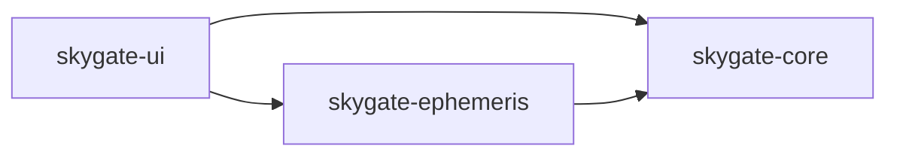

# Skygate Architecture

## Overview
Skygate is an in-process Qt 6 desktop application for rendering an interactive
sky view. The codebase is organized into three CMake modules with clear
dependency direction:

- `apps/skygate-ui`
  - Qt Quick application shell, QML views, presentation state, catalog
    download/import workflow, persistence, and scene-graph rendering.
- `libs/skygate-core`
  - UI-independent domain types, projection contracts, projection
    implementations, viewport math, and time abstractions.
- `libs/skygate-ephemeris`
  - Star catalog loading/parsing, identity-based composition, catalog
    normalization, constellation data, astronomical coordinate calculation,
    and snapshot generation.

Dependency flow is one-way:

```mermaid
flowchart LR
    UI["skygate-ui"] --> EPH["skygate-ephemeris"]
    UI --> CORE["skygate-core"]
    EPH --> CORE
```

`skygate-core` is the lowest-level reusable library. `skygate-ephemeris` builds
on it. `skygate-ui` composes both and owns Qt-specific behavior.

## High-Level Runtime Flow
At startup, `apps/skygate-ui/src/main.cpp` configures logging, loads bundled
ephemeris-data metadata when present, registers the QML/C++ types, and wires
the UI object graph:

1. `SkyContextController` owns the mutable application state exposed to QML.
2. `SkyCatalogManager` owns the configured catalog source collection and
   delegates active composition to `SkyCatalogRuntime`, while
   `SkyEphemerisDataManager` owns bundled/installed high-precision data state.
3. `SkyContextController` attempts to recreate the selected ephemeris engine
   from the current catalog, engine settings, and active ephemeris data. If a
   data refresh would only produce a simple fallback while a high-precision
   engine is already active, it keeps the active high-precision engine.
   Time-scale, Earth-orientation, and kernel providers derived from the active
   data set are cached across engine rebuilds and invalidated when the data
   set changes. The cached kernel provider skips per-open checksum
   verification because installed data is checksum-verified when it is
   activated.
4. `SkySceneModel` listens to the controller and derives renderable scene data.
5. `SkyViewportItem` consumes the scene model and renders the sky with Qt Quick
   scene graph nodes.
6. QML overlays and toolbars provide interaction, labels, preferences, and
   status surfaces around the custom viewport.

Normal frame production works like this:

1. User input, timer ticks, settings restore, location updates, or catalog
   changes mutate `SkyContextController`.
2. The controller emits `skyContextChanged()`.
3. `SkySceneModel` decides whether it must recompute an ephemeris snapshot,
   rebuild projected render data, or both.
4. `SkyRenderFrameBuilder` converts snapshot data into render points, lines,
   symbolic deep-sky glyphs, and overlay labels.
5. `SkyViewportItem` copies the derived frame into render data and rebuilds
   batched `QSGNode` geometry.
6. QML overlay components render hover labels and scene annotations on top of
   the viewport.

## Module Details

### `skygate-ui`
This module is the application layer and the most stateful part of the system.
`apps/skygate-ui/src/main.cpp` stays with the executable target. The
`skygate-ui-lib` sources under `apps/skygate-ui/src` are grouped by subsystem:
`app`, `catalog`, `diagnostics`, `location`, `platform`, `render`, `scene`,
`search`, `selection`, `settings`, `theme`, and `time`.

#### Main presentation objects
- `SkyContextController`
  - Primary QML-facing controller (`QObject` with `Q_PROPERTY` and
    `Q_INVOKABLE` API).
  - Owns the current `skygate::core::ObservationContext`, projection selection,
    view center/FOV, playback state, timeline settings, location source
    selection, and location status.
  - Owns `SkySettingsStore`, `SkyCatalogManager`, `SkyEphemerisDataManager`,
    and the bundled city catalog model used by Preferences.
  - Owns the selected `IEphemerisEngine` and recreates it when catalog,
    engine-option, or ephemeris-data state changes.
  - Owns `SkyTimeController`, the QML-facing date/time surface for display
    timezone selection, civil-time formatting, and fixed-time entry.
  - Uses a `QTimer` for live timeline updates.
  - Optionally requests a one-shot observer location update through Qt
    Positioning when the persisted location source is `Current Device`.
  - Loads persisted settings and restored catalog cache during initialization.
- `SkySceneModel`
  - Read-model / derived-state layer between controller state and rendering.
  - Listens to `SkyContextController::skyContextChanged()`.
  - Produces:
    - cached `skygate::ephemeris::EphemerisSnapshot`
    - cached `skygate::core::PreparedProjection`
    - `SkyRenderFrame` with projected points, constellation segments,
      deep-sky glyphs, and labels
    - `overlayItems` for QML overlays
  - Also builds a spatial hover lookup for hit-testing object labels.
- `SkyViewportItem`
  - Custom `QQuickItem` responsible for drawing the sky in the Qt scene graph.
  - Renders:
    - projected celestial points
    - symbolic Messier deep-sky glyphs
    - projected constellation segments
    - horizon line
    - altitude/azimuth grid
    - highlighted cardinal azimuth lines
  - Uses a mutex-protected shared render-data snapshot to bridge scene-model
    data into `updatePaintNode()`.

#### QML composition
`apps/skygate-ui/qml/Main.qml` composes several layers:

- `SkyViewportItem`
  - Base rendered star field and line work.
- `SkyInteractionLayer`
  - Mouse drag pan, wheel or pinch zoom, and hover hit-testing.
- `SkyOverlayLayer`
  - Text labels for objects and cardinal directions, plus collision avoidance
    with the timeline toolbar.
- `TimelineToolbar`
  - Playback, stepping, speed, magnitude cutoff, and view reset controls.
- `PreferencesWindow`
  - Observer location, projection, and catalog management UI.
  - Uses `PreferencesDraft.qml` as a staged edit buffer before applying changes
    back to `SkyContextController`.
  - Includes a source-aware location workflow with `Current Device`, `City`,
    and `Custom` modes plus a searchable city picker backed by the bundled
    catalog model.
- `StatusFooter`
  - Current context and catalog status summary.
  - Hosts the clickable selected-timezone text that opens the compact
    fixed-time popup.

This is intentionally a hybrid UI architecture: heavy drawing happens in C++
scene graph code, while transient UI and chrome stay in QML.

#### Catalog and settings subsystem
- `SkyCatalogManager`
  - QML-facing owner of the configured catalog source collection and its
    lifecycle: load, reload, enable/disable, reorder, remove, clear cache, and
    restore.
  - Keeps one operation record per source instance with a monotonic operation
    revision, so a response captured for a superseded incarnation can never
    apply to its successor while unrelated instances keep their pending work.
  - Delegates active composition and related-data ownership to
    `SkyCatalogRuntime` and persistence/migration to
    `SkyCatalogCacheController`. Only an accepted transition persists state
    and emits `catalogChanged`, which causes `SkyContextController` to rebuild
    the selected ephemeris engine.
- `SkyCatalogRuntime`
  - Owns the configured source records, the composed active `IStarCatalog`,
    the counts and provenance that describe it, and the composed related
    constellation view.
  - Stages a transition (candidate configuration, composition, counts,
    provenance, related view, revision) before publishing it. A rejected
    transition reports the operation error and leaves the last accepted state
    exactly as it was.
- `SkyCatalogCacheController`
  - Persists and restores the collection configuration, per-instance payload
    and binary sidecars, and per-source related datasets.
  - Migrates the legacy two-slot cache once, and only for a true first-use
    outcome (no collection was ever committed); neither an unreadable
    committed collection nor a readable older flat collection is replaced
    by retired legacy data.
- `SkyCatalogImportWorkflow`
  - Downloads and parses one source instance through `CatalogCoordinator`
    using that instance's parse options (schema hint and archive member
    selector).
- `SkyCatalogPresets`
  - Static descriptor table for the built-in presets (bundled, HYG v4.2,
    bundled Messier, OpenNGC): stable source ID, title, version, URLs, schema
    hint, archive selector, related-dataset URLs, attribution, and category.
- `SkyEphemerisDataManager`
  - Owns bundled manifest state and installed high-precision data cache state.
  - Reports kernel, Earth-orientation, leap-second, and Delta T status to QML.
  - Stages and atomically activates verified ephemeris data updates.
  - Emits data-revision changes that invalidate the selected engine and scene
    caches.
- `CatalogCoordinator`
  - Orchestrates the download and parse workflow.
  - Separates transport concerns from parse concerns.
- `CatalogDownloadService`
  - Tries multiple URLs until the first successful download.
  - Applies request headers, timeout, and maximum payload size checks.
- `CatalogPayloadParseService`
  - Parses downloaded payloads on `QThreadPool::globalInstance()`.
  - Marshals progress and completion callbacks back onto the UI thread.
- `SkySettingsStore`
  - Persists controller state in `QSettings`.
  - Persists location source and selected city id alongside raw observer
    coordinates so device/city/custom modes survive relaunch.
  - Persists the selected display timezone as an IANA timezone id; UTC remains
    the internal calculation and storage time basis.
  - Persists the catalog collection configuration (instance identity, order,
    policy, enabled state, parse options, attribution, bundled flag) in
    `QSettings`, and per-instance payload/binary sidecars in the app-data
    cache directory. A stored snapshot is written even when the collection is
    intentionally empty. The legacy two-slot cache keys remain readable for
    migration only. An older flat collection stays the committed
    configuration even when an interrupted upgrade staged generation
    records beside it: the flat records load while the staged records and
    payloads are ignored with a diagnostic. Loading the collection returns
    an explicit outcome: no committed collection, a loaded collection (an
    empty one is valid), or unusable committed configuration with
    diagnostics.
- `SkyCatalogSourcePresetModel` / `SkyCatalogSourceCollectionModel`
  - Read-only `QAbstractListModel` surfaces for the available preset
    descriptors and the active source collection.
  - Rows keep the durable instance ID as identity, so equal titles or URLs do
    not collapse distinct sources.
- `LocationCatalogModel`
  - Loads a bundled CSV of major cities from Qt resources.
  - Exposes a flat, filterable `QAbstractListModel` with country headers and
    city rows for the Preferences location picker.
- `TimeZoneCatalogModel`
  - Uses Qt's timezone database to expose a searchable IANA timezone list for
    Preferences.

#### Catalog collection lifecycle

- **Preset vs instance identity.** `SkyCatalogSourceDescriptor` is a preset
  template; `SkyCatalogSourceInstance` is a configured instance. The instance
  ID is allocated when the instance is added
  (`SkyCatalogSourceInstance::allocateInstanceId`) and stays fixed through
  reload, reorder, cache, provenance, and restart. `descriptorId` records the
  template an instance came from, and version or archive selection never
  enters the ID, so two instances of one descriptor and two versions or member
  selections at one URL stay distinct.
- **First use versus configured emptiness.** The bundled default source is
  installed only while no saved configuration has been considered yet. Once a
  configuration is installed, removing the sole source or replacing the
  collection with an empty one stays empty through every rebuild; no later
  rebuild silently recreates a configured source.
- **Atomic activation.** A source mutation or rebuild composes the candidate
  configuration and every derived value before publishing. Configured
  sources, active snapshot, counts, provenance, related view, and revision
  change together, and only for an accepted composition. A rejected
  transition (null catalog, composition rejection, missing bundled catalog)
  reports the operation error and keeps the last accepted state; a deliberate
  empty result is a published state, not a half-applied failure.
- **Related data ownership.** Constellation lines, anchor groups, and the
  declared count belong to the source instance whose related download
  produced them (`SkyCatalogSourceRecord::constellationData`). Disabling a
  source keeps its data owned but inactive; removing the source removes the
  data. The active view composes the owned datasets of the enabled sources in
  visible collection order:
  - line segments are kept in visible order, and an exact duplicate segment
    from a later contributor is kept once;
  - anchor groups are keyed by constellation name, and a later contributor's
    definition replaces an earlier one, matching later-wins object precedence;
  - the declared count comes from the last enabled contributor that declares
    one and is never lower than the number of distinct names in the view.

  References resolve through `ConstellationReferenceResolver` against the
  active snapshot, so they follow the surviving object identity even when the
  winning star came from another catalog.
- **Related-data retirement.** An accepted activation applies the old and new
  related-data declaration to the instance's own dataset before the
  transition is persisted or published: a declaration that still selects
  related data supersedes the dataset owned by the replaced catalog until
  the replacement's own download completes, and a declaration that no longer
  selects related data retires the obsolete dataset. Downloaded and bundled
  activation paths share this rule, independent of composition policy and
  payload origin, and no other instance's dataset is touched; a rejected
  update keeps the previously accepted dataset.
- **Configuration versus payload cache.** Durable configuration and
  disposable payload data are separate stores. Clearing one source's cache
  evicts only its disposable payloads (catalog bytes, binary cache, and its
  owned related payload); the configured record (identity, order, enabled
  state, descriptor, parse options, and URLs) survives. The accepted
  in-memory snapshot stays active for the session; after a restart the
  source is still configured and reports an unavailable payload with retry
  state, and ordinary persistence never writes the evicted bytes back. Only
  a later accepted load repopulates payloads, and Remove stays the only
  configuration-deletion operation. A configured source whose payload is
  missing or corrupt likewise stays configured and reports its own error
  without erasing siblings.
- **Live restore.** A successful restore replaces the runtime collection and
  the operation/accepted-facts state atomically. Operations omitted from the
  restored collection are dropped, and outstanding callbacks are superseded
  by fresh revisions, including when a restored source reuses an existing
  instance ID: a late reply can neither repopulate an omitted source nor
  mutate a restored instance. A rejected restore preserves the previous
  accepted collection and still-valid work.
- **Migration boundary.** Existing installations migrate the legacy two-slot
  cache once, and only while no collection has ever been committed. A
  collection committed in the older flat format counts, even when no
  generation has committed, so an interrupted first upgrade that staged
  generation records without a manifest stays on the flat collection
  instead of migrating. Legacy instance IDs are derived deterministically
  exactly at that boundary, and a legacy collection-wide related payload
  establishes an owner only when a single record makes that unambiguous.
  Migration is acknowledged only after the new configuration is committed,
  so an interrupted migration keeps the legacy data readable and an
  intentionally emptied collection does not resurrect migrated sources.
- **Storage recovery states.** Loading the committed collection distinguishes
  no committed collection, a loaded collection (an empty one is valid), and
  unusable committed configuration, with diagnostics and a durable
  committed-generation record. A collection already committed in the older
  flat format is Loaded on its own terms: while its version marker and
  source records are intact, generation groups staged by an interrupted
  upgrade are ignored with a diagnostic, their records and payloads are
  never promoted, and the flat records load with their versions, order,
  IDs, and options. Only when generation records actually replaced the
  flat records does the stale marker make the committed configuration
  unusable. Legacy migration runs only for the no-committed-collection
  state; a missing or truncated manifest or a missing referenced generation
  reports a rejected restore instead of being treated as first use. A
  staged-but-uncommitted generation is never chosen as the current
  collection, and a deliberately evicted per-source payload remains a
  readable configured record that reports unavailable payload state,
  distinctly from unreadable committed data.

### `skygate-core`
This module provides stable, UI-independent core types and projection logic.

#### Core types
- `GeoLocation`
- `UtcTimePoint`
- `EquatorialCoordinate`
- `HorizontalCoordinate`
- `ObservationContext`
- `ProjectionType`
- `ProjectionParams`
- `ScreenPoint`

These types are intentionally small value types so they can move cheaply across
module boundaries.

#### Projection subsystem
- `IProjection`
  - Runtime strategy interface for projections.
- `createProjection(ProjectionType)`
  - Factory for selecting a concrete projection implementation.
- Concrete strategies:
  - `StereographicProjection`
  - `AzimuthalEquidistantProjection`
  - `PerspectiveProjection`
- `PreparedProjection`
  - Per-frame precomputation object used by the render path.
  - Stores the normalized center basis and projection-specific constants so
    large render passes do not repeat setup work for every star.
- `ProjectionAlgorithms`
  - Internal implementation shared by direct projection strategies and
    `PreparedProjection`, so projection formulas have one behavioral source.
- `ProjectionPipeline`
  - Internal helper for turning normalized projection results into
    `ScreenPoint` status and viewport coordinates.
- Focused geometry helpers
  - `Geometry2d` for primitive 2D math, rectangles, and line segments.
  - `RectOccupancyGrid` and `CircleHitIndex` for screen-space indexes.
  - `LinePattern` for dash generation.
  - `ProjectedPolylineBuilder` for projection-aware polyline splitting.
- `SphericalGeometry`
  - Core spherical/vector helpers shared by projection and ephemeris code.

`PreparedProjection` is the preferred high-throughput path in the current UI.
The `IProjection` strategies still exist as a clean abstraction boundary and are
used by the controller for projection selection and sample output.

#### Time abstraction
- `ITimeSource`
  - Small interface used to make time acquisition replaceable and testable.
- `SystemTimeSource`
  - Default production implementation.
- `UtcTimePoint` / `UtcTimeCodec`
  - Microsecond UTC timestamp storage and epoch-scalar conversion.
- `TimeScale`
  - UTC/TAI/TT/TDB/UT1 enum used across time-scale conversion boundaries.
- `CivilDateTime` / `CalendarTime`
  - Proleptic Gregorian civil-date validation and civil-date/epoch mapping.
- `AstronomicalEpoch`
  - Two-part Julian-date value with normalization, arithmetic, and ordering.
- `EpochCodec`
  - UTC time to Julian-date/J2000 epoch conversion.
- `AstronomicalTime`
  - Mean obliquity and Greenwich mean sidereal time helpers.

Calendar and Julian-date arithmetic intentionally lives in `skygate-core` so
both the simple and high-precision engines share one time implementation.

### `skygate-ephemeris`
This module owns celestial body metadata, catalog parsing, and runtime sky
computation.

#### Catalog model
- `IStarCatalog`
  - Abstract read-only catalog interface.
- `InMemoryStarCatalog`
  - Current concrete catalog implementation backed by a `CelestialBodyCatalog`.
- `BaseCelestialBody`
  - Polymorphic base for body metadata. It owns common id, display name, body
    kind, and magnitude fields, and exposes virtual accessors for optional
    fixed coordinates, star astrometry, and deep-sky metadata.
- `OwnGalaxyCelestialBody` / `DistantCelestialBody`
  - Concrete body storage for own-galaxy and distant objects.
- `CelestialBodyCatalog`
  - Owns separate concrete body vectors and a stable ordered pointer view used
    by engines, snapshots, search, and rendering.

#### Snapshot model
- `IEphemerisEngine`
  - Pure interface for computing an `EphemerisSnapshot` from a
    `core::ObservationContext` and resolving individual body states.
- `EphemerisEngineQueries`
  - Query helper routing lookups through the engine's direct single-body
    virtual overloads, with snapshot-scan helpers for finding a body state
    inside an already-computed snapshot.
- `EphemerisSnapshot`
  - Current context
  - shared immutable catalog body vector
  - per-frame body states that reference catalog bodies by index

This immutable/shared snapshot shape avoids copying full body metadata into each
frame and keeps rendering decoupled from catalog ownership.

#### Request time contract
`EphemerisRequest` carries both an explicit astronomical epoch and a UTC time
inside its observation context. For request-based engine calls the explicit
`request.epoch` is the single authoritative computation instant; engines must
not substitute `request.context.utcTime` for a valid explicit epoch. The
observation-context convenience overloads carry no explicit epoch: they build
an `EphemerisRequest` from the engine's current options and a UTC epoch derived
from `context.utcTime` (`EphemerisRequestFactory::requestFromContext`), so that
derived UTC epoch is the authoritative instant for those calls. Callers that
need a non-UTC epoch or explicit correction control should build an
`EphemerisRequest` directly.

Engines enforce this contract according to their capabilities. The simple
engine is UTC-only: when it receives an explicit non-UTC epoch it reports each
body as unsupported (`EphemerisEngineQueryStatus::Unsupported` with the
`UnsupportedTimeScaleConversion` warning) instead of silently using
`context.utcTime`. The high-precision engine honors explicit epochs: it rejects
a non-explicit (default/zero) epoch as a failed computation, uses TDB epochs
directly for kernel queries, and converts other scales through its injected
time-scale service, recording any conversion metadata.

#### Engine implementation
Engines are created through `EphemerisEngineFactory`.

The always-available engine is `SimpleEphemerisEngine`.

Its responsibilities are:

- keep an immutable `CelestialBodyCatalog`
- dispatch coordinate generation by `BaseCelestialBody::Kind` and available
  fixed-equatorial catalog coordinates
- delegate to focused calculators/lookups:
  - `SunEquatorialCalculator`
  - `MoonEquatorialCalculator`
  - `PlanetEquatorialCalculator`
- consume catalog-owned `fixedEquatorial` coordinates for fixed catalog bodies
  such as stars, constellations, and deep sky objects
- convert ecliptic coordinates to equatorial coordinates via
  `EclipticToEquatorialCalculator`
- convert equatorial coordinates to horizontal coordinates via
  `EquatorialToHorizontalCalculator`
- centralize Julian day, J2000, obliquity, and sidereal-time helpers in
  `AstronomicalTime`

When `SKYGATE_ENABLE_HIGH_PRECISION_EPHEMERIS=ON`, the factory can also create
`HighPrecisionEphemerisEngine`. That engine is a facade over focused
high-precision providers and calculators:

- `CalcephKernelProvider`
- `SolarSystemStateCalculator`
- `StarAstrometryCalculator`
- `LeapSecondTimeScaleService`
- `IEarthOrientationProvider`
- `TableBackedEarthOrientationProvider`
- `EarthOrientationDataParser`
- `EarthOrientationDataLoader`
- `EarthOrientationSampler`
- `ErfaFrameTransformer`
- `ApparentPlaceCalculator`
- `AtmosphericRefractionCalculator`
- `EphemerisComputationCache`

High-precision pipeline contracts have individual headers and companion sources:
`HighPrecisionComputationInput`, `HighPrecisionCalculatorResult`,
`PreparedEphemerisRequestState`, and `StarAstrometryBatchResult`. Kernel state
results belong to `ICalcephKernel::StateResult`; engine construction uses
`HighPrecisionEphemerisEngine::Dependencies`. Consumers include the specific
contracts they use.

Earth-orientation parsing returns validated rows and metadata without
constructing a provider. The loader obtains snapshot assets, applies
reference-epoch staleness, and creates an immutable table-backed provider.
The separate sampler resolves UT1-UTC and polar motion using caller-owned
fallback options and reports sample warnings. Provider contract types are
nested in the interface; parsing, loading, and sampling types are nested
in their respective classes.

Ephemeris data updates use two independent library operations:
`EphemerisStagedUpdateVerification::verify()` checks the staged profile,
component metadata, and payloads without activating files.
`EphemerisDataActivation::activate()` writes a validated asset into the cache
and promotes it atomically. Each class has separate request, result, and status
types. Both use `EphemerisDataPayloadReader` for streaming decompression and
checksums; their operation-specific helpers remain in their source files.

Manifest assets with `live: true` describe upstream files that may change
without a manifest update (for example the IERS Earth-orientation series).
Live assets may omit checksum and size metadata; verification and activation
still require a readable non-empty payload and a valid manifest validity
range, but they do not enforce exact size or checksum equality. Pinned
(non-live) assets, including all solar-system kernels, keep the strict
size and sha256 checks.

The factory supports strict high-precision creation or simple-engine fallback
through `EphemerisFactoryFallbackPolicy`. `SkyContextController` owns the
selected engine kind, correction options, refraction settings, data manager,
and diagnostics surfaced to the UI.

#### High-precision interface layer
Replaceable high-precision subsystems are exposed as narrow `I*` contracts so
the engine and factory depend on behavior rather than concrete providers:

- `ICalcephKernel` / `ICalcephKernelProvider` for kernel state and kernel
  acquisition
- `IDeltaTProvider`, `ILeapSecondProvider`, and `IEarthOrientationProvider`
  for time-scale support tables
- `ITimeScaleService` for UTC/TAI/TT/TDB/UT1 conversion
- `ISolarSystemStateCalculator` and `IStarAstrometryCalculator` for body
  state and catalog-star astrometry
- `IApparentPlaceCalculator` and `IAtmosphericRefractionCalculator` for
  apparent/topocentric corrections
- `IEphemerisComputationCache`, `IEphemerisResultBuilder`, and
  `IFrameTransformer` for caching, result assembly, and frame transforms
- `IEphemerisFallbackStrategy` for simple-engine degradation
- `IEphemerisDataSnapshot` for staged high-precision data assets

Concrete implementations (`CalcephKernel`, `TableBacked*Provider`,
`LeapSecondTimeScaleService`, the calculators, `EphemerisComputationCache`,
`ErfaFrameTransformer`, and `SimpleEphemerisFallbackStrategy`) are wired
through `EphemerisEngineFactory` and injected as `shared_ptr<const ...>`
dependencies.

#### Fallback strategy
Fallback is implemented once in the simple-engine module as
`SimpleEphemerisFallbackStrategy`, which is injected into the high-precision
engine through `IEphemerisFallbackStrategy`. When a high-precision request is
out of range and the request explicitly allows fallback, the strategy produces
a simple-engine body state, marks the high-precision result as degraded, and
records the corrections that could not be applied as unavailable.

Creation and runtime degradation use separate policies.
`EphemerisEngineFactoryRequest::fallbackPolicy` governs whether factory
creation may substitute the simple engine for a requested high-precision
engine. It defaults to `AllowSimpleEngineFallback`, so a default
high-precision request keeps the existing fallback behavior. Setting it to
`StrictHighPrecision` makes creation fail with
`FailedStrictHighPrecisionUnavailable` when high-precision dependencies are
unavailable, regardless of the runtime option.
`EphemerisEngineOptions::fallbackToSimpleEngine()` only governs runtime
degradation inside an already-created high-precision engine; its default
remains `true`.

#### Guidance versus runtime fallback
Event and trail sampling use an explicit `IEphemerisGuidanceStrategy`.
`SimpleEphemerisGuidanceStrategy` creates an inexpensive simple engine for
guided event search and UI guidance trails. This is a separately selected
sampling path, independent of factory creation fallback and runtime
degradation: turning off fallback does not remove guidance, and guidance
samples do not imply a degraded high-precision result.

#### Requested vs effective engine identity
`EphemerisEngineFactoryResult` distinguishes the engine the caller asked for
from the engine actually produced. `requestedKind()` is the kind passed to the
factory; `effectiveKind()` is the kind of the returned engine (or the requested
kind when creation fails). A high-precision request whose dependencies are
unavailable therefore succeeds with
`requestedKind() == EphemerisEngineKind::Type::HighPrecision`, a `Simple`
engine, and `EphemerisFactoryCreationStatus::CreatedSimpleFallback`, which
`usedSimpleEngineFallback()` reports.

`SkyContextController` uses that distinction when it rebuilds the active
engine. If a rebuild would replace an active high-precision engine with a
simple fallback, the controller keeps the active engine instead of applying
the lower-fidelity result. The generic rule is that a degraded fallback never
silently replaces a more capable active engine: the active engine remains in
effect until a rebuild produces an engine at the requested capability.

#### Catalog schema and container split
Catalog ingestion separates payload containers from payload schemas.

- A schema defines how a decoded plain-text payload maps to catalog bodies.
  `CatalogSchemaRegistry` is the single source of truth: a
  `CatalogSchemaDescriptor` records the schema type, diagnostic name,
  delimiter, exact required columns, and parser factory for each registered
  schema. Built-in schemas are the bundled starter catalog, HYG CSV
  (comma-separated, required `ra`/`dec`/`mag`), and OpenNGC CSV
  (semicolon-separated, required `Name`/`Type`/`RA`/`Dec`). Header detection,
  parser selection, and parse diagnostics all read the same descriptors.
- A container is an encoding layer around any schema. `CatalogPayloadParser`
  decodes at most one gzip or ZIP layer before schema dispatch, then detects
  the schema of the decoded payload. Nested archives are reported as an
  unsupported inner schema instead of being decoded recursively. A ZIP member
  can be selected explicitly through `CatalogParseRequest::memberSelector`;
  otherwise the unique supported member is chosen deterministically and
  missing or ambiguous members are explicit errors. Container codecs
  (`CompressedDataInflater` and the private `io/zip` layers) are shared by
  every schema rather than owned by one source.
- Parse options travel as one value. `CatalogParseRequest` carries the
  payload, an optional archive member selector, and an optional schema hint.
  Detection stays authoritative: a detected schema that differs from a
  concrete hint fails with
  `CatalogLoadResult::ErrorCode::SchemaHintMismatch` instead of silently
  parsing something else. `CatalogSelectionOptions` can truncate to the
  brightest N bodies after parsing.

The public catalog API has only narrow front doors:

- `CatalogPayloadParser` for unknown downloaded/imported payloads (container
  decoding, detection, and parsing).
- `CatalogLoader::load(...)` for a known schema plus an already-decoded
  payload, with diagnostics.
- `CatalogFactory::createStarCatalogFromBodies(...)` and
  `createBundledStarCatalog()` for test/UI fixtures, already parsed bodies,
  and the bundled starter dataset.
- `CatalogSchemaRegistry::registerSchema(...)` to add a schema.
- `CatalogComposer::composeCollection(...)` for ordered source collection
  composition; application composition lives in `SkyCatalogRuntime`.

Parsers implement `ICatalogParser` and return a `CatalogBodyParseResult`;
schema-specific field mapping stays local (`HygCatalogParser`,
`OpenNgcObjectMapper`, `BundledCatalogParser`). Parsed own-galaxy bodies are
normalized by `CatalogBodyNormalization`; distant deep-sky bodies keep
parser-provided metadata. `CatalogSnapshotValidator` enforces the snapshot
invariants at construction boundaries, and the final catalog is materialized
as an `InMemoryStarCatalog`.

Catalog parsing uses private helpers to avoid repeated policy fragments:
`StringUtilities` centralizes small ASCII normalization helpers,
`CatalogParsingUtilities` centralizes catalog field parsing, and
`OpenNgcObjectMapper` owns OpenNGC alias/id/display-name/object-kind mapping.
ZIP handling is split into private layers: `ZipDirectoryReader` parses
central-directory metadata, `CatalogZipEntrySelector` applies the archive
member choice policy, and `ZipEntryExtractor` validates local headers and
inflates entry payloads.

Private catalog implementation files are grouped by responsibility under
`libs/skygate-ephemeris/src/catalog`: orchestration facades at the catalog root,
normalization in `normalize/`, identity-based composition in `composition/`,
source-specific parsers in `bundled/`, `hyg/`, `opengc/`, and `stellarium/`,
constellation codecs in `constellation/`, and payload/archive IO in `io/` and
`io/zip/`. Shared string helpers live directly under
`libs/skygate-ephemeris/src`.

#### Object identity and merge precedence
Identity and display metadata stay separate:

- `BaseCelestialBody::id` is the canonical object identity used by rendering,
  search, ephemeris, and references. It comes from the highest-priority
  source identifier at parse time (for example `hip_<n>`, `hyg_<n>`,
  `ngc_<n>`, `messier_<nnn>`), never from a display name or sky position.
- `CatalogObjectIdentity` preserves the source facts separately: the raw
  source record key (`sourceRecordId`), namespaced cross-identifiers
  (`CatalogIdentifier` with per-namespace normalization), display aliases,
  and the scope of the canonical ID.
- `IdScope::Global` marks a recognized astronomical designation or domain
  identity (including planet IDs such as `mercury`). `IdScope::SourceLocal`
  marks a parser-generated record key such as `hyg_auto_<n>` for a row
  without any recognized designation. Composition qualifies a source-local ID
  with its owning instance ID (`hyg_auto_1@<sourceId>`), so equal counters
  from unrelated sources never match while a reload of the same instance
  keeps the same object key.

`CatalogIdentityIndex` resolves canonical IDs, external identifiers, and
deep-sky aliases against the current survivors while the merge proceeds. It
prefers authoritative keys (canonical ID, external identifier) over aliases
and reports ambiguous matches explicitly.

`CatalogCompositionMerger` is the single merge implementation:

- A collection composes in order. Within one source, the first record for an
  identity is authoritative and later duplicates fill its missing metadata.
  Across replacing sources, a later source has higher precedence: its matching
  record replaces the earlier survivor and absorbs the earlier body's
  non-conflicting identifiers, aliases, and metadata. The winner's own present
  values stay authoritative; a value it is missing is taken from the
  highest-precedence source that actually supplied it, even when that source
  reached the survivor through an intermediate survivor. The absorbed body's
  canonical id, and every canonical id it already retained, stay on the
  survivor as retained canonical ids: later rows, later compositions,
  restored snapshots, and a snapshot fed back as a composition input still
  resolve the earlier identity to the single survivor. The public canonical
  id stays the surviving record's own id: the replacing record's for a
  replacement, the bridging record's for a bridge. That choice never
  changes which row's metadata outranks which.
- Enriched fields resolve per field from the source that actually supplied
  the value. A field inherited through an intermediate survivor keeps the
  rank of its supplying source instead of being promoted to the survivor's
  rank, so an explicit higher-precedence value stays authoritative while an
  absent field and a valid zero value keep their meaning, and separate
  optional fields resolve independently. Within one source, each field keeps
  the earliest row that supplied it, so a bridge across a source's own
  survivors fills only missing fields and never demotes values the earlier
  rows supplied. When the collection pass resolves a record of the source
  being merged to a survivor its own earlier rows produced, it fills missing
  values, keeps values the survivor inherited from other sources, and
  resolves a value both records supply from this source by the earlier
  supplying row, even when bridge absorption moved the survivor away from
  its original row order.
- Field origins are per merge run and are not carried by a body. An
  already-materialized snapshot supplied as one new source counts every
  value it holds as supplied by that source, so no cross-snapshot field
  history is promised or recovered.
- The identity-to-survivor index stays current: a replacement vacates the
  earlier survivor's keys, and identifiers acquired by a metadata union are
  registered before the next record resolves. Later records can therefore
  match identifiers an earlier record acquired in the same source pass, and a
  record that bridges several survivors of one kind collapses them into a
  single survivor with complete contributors. Identity bridging decides
  which records are one object, not which row's metadata wins, so the
  earlier rows keep their precedence under the within-source row order.
  Matched survivors of an incompatible kind stay distinct with a diagnostic.
- Weak deep-sky alias matches merge only when neither record carries a
  conflicting authoritative designation; two distinct recognized
  designations that share a common display name stay distinct.
- Coordinates merge as one coherent model per survivor, selected before any
  compatibility check. The model anchor is the fixed position together with
  the astrometry reference position and reference epoch; astrometry without
  motion or parallax fields still anchors a model. The anchor origin is the
  higher-precedence origin among the model components the survivor carries.
  A losing model whose anchor origin outranks the winner's replaces the
  winner's whole model, so copying the record that bridges two objects never
  preselects a model the earlier supplying row outranks. The replaced
  model's compatible astrometry still enriches the selected model field by
  field, including when a fixed-only model replaces a bridge's astrometry:
  the selected fixed position stays the model's anchor and the adopted
  fields keep the origins of the records that supplied them instead of
  moving to the selected anchor's row. A contradicting replaced position or
  astrometry is diagnosed, never combined with it, and a compatible
  replaced fixed position is dropped with the rest of the replaced model.
  A donor whose own fixed position contradicts its own astrometry
  contributes only its fixed position, and the discarded astrometry is
  rejected with a diagnostic. With the winner's model
  selected, a losing fixed position fills a missing winner position or
  replaces one when the losing position's origin outranks the winner's — a
  higher source rank, or an earlier supplying row within the same source —
  and never replaces a value the winner carries from a higher-precedence
  source. It never enters a model whose astrometry anchors the object at a
  different direction, because a fixed position carries no reference epoch
  to convert; a conflicting position the winner carries is diagnosed and
  replaced. A compatible losing astrometry enters only when it agrees
  with the surviving model, either directly against a fixed position or
  against the winning reference
  position after its own proper motion accounts for the reference-epoch
  difference; it fills missing proper motion, parallax, radial velocity, and
  validity fields, and it replaces a field when the losing value's origin
  outranks the winner's — a higher source rank, or an earlier supplying row
  within the same source — and never replaces a value the winner carries
  from a higher-precedence source. Contradictory losing coordinates are
  rejected with a diagnostic that names the kept model.
- After the merge, an authoritative identity shared by two active survivors
  of the same kind is an internal merge error; a shared identity across
  incompatible kinds is a deliberate, already diagnosed conflict.

`CatalogCompositionResult` reports provenance for the composition: `sourceIds`
is parallel to the composed snapshot and names the winning source instance per
body, and `contributorSourceIds` lists every contributing source in descending
source precedence: the winner's source first, then each remaining contributor
highest precedence first, every contributing source once. Accumulator
insertion positions after a replacement or bridge carry no precedence; within
one source, the first row is authoritative and later rows only fill it.
`CatalogCompositionRequest` (`sourceId`, `enabled`, catalog,
`CatalogCompositionPolicy`) rejects empty or duplicate source identities with
an explicit diagnostic instead of conflating provenance.

#### Composition policy and fallback
Policy is part of the configuration, not a hidden merge step:

- `CatalogCompositionPolicy::Merge` and `DeepSkyOnly` are replacing sources:
  later sources win and absorb non-conflicting metadata.
- Every policy shares one identity decision. A gap-fill body is skipped only
  when its identity resolves to an existing survivor through the same kind,
  designation, and ambiguity checks `Merge` uses; a contradicted or ambiguous
  weak alias match keeps the body as an independent object with the normal
  diagnostic, and a fallback row that matches a configured survivor preserves
  the configured winner's values.
- `AugmentCore` contributes only non-deep-sky bodies as a gap-fill; it also
  enables the bundled bright-star fallback when no source supplies a star.
  The runtime always adds it as a derived contribution so Sun, Moon, and
  planet bodies exist; it is not a configured collection source.
- `DeepSkyFallback` contributes only deep-sky identities that no configured
  source supplies. It never replaces a configured source's body or its
  visible collection position, so configured values always win over bundled
  fallback data.
- Bundled augmentation and fallback carry their own provenance
  (`bundled-core`, `bundled-deep-sky`) instead of being attributed to another
  source.

`SkyCatalogRuntimeBuildOptions::BundledDeepSkyParticipation` makes bundled
deep-sky participation an explicit configuration choice (`Disabled` or
`Fallback`); legacy preset controls delegate to the same configuration. The
bundled fallback cannot alter an explicit source's values (the R9
counterexample: a configured M31 with magnitude 0 keeps that magnitude).

Deep-sky objects remain a fixed-equatorial catalog layer. The UI can use
bundled Messier data or download/update the OpenNGC preset. OpenNGC records
are parsed and deduplicated in `libs/skygate-ephemeris`, not in QML or scene
graph code.

#### Constellation data
Constellation lines and label anchors have one persisted/imported source:

- optional downloaded Stellarium skyculture data parsed by
  `StellariumConstellationParser`

`SkyCatalogManager` keeps the dataset produced by a source instance's related
download owned by that instance and persists it with the instance. When
Stellarium constellation data is not available or cannot be parsed, the app
keeps constellation refs empty rather than rendering hand-authored bundled
outlines. The active view is composed from the owned datasets of the enabled
sources by `SkyCatalogRuntime`, and `ConstellationReferenceResolver` maps the
dataset's HIP-based references onto the surviving objects of the active
snapshot.

`StellariumConstellationParser` is a small orchestration entrypoint over
private helpers: `StellariumHipParser`, `StellariumLineRefExtractor`, and
`StellariumAnchorGroupExtractor`.

## Result semantics
`CelestialBodyState` carries a body index, an `EquatorialCoordinate`
(right ascension/declination), a `HorizontalCoordinate`
(altitude/azimuth), and an `EphemerisEngineQueryResult` metadata block. The
meaning of the coordinates depends on the engine and on the requested
corrections.

### Simple engine coordinates and corrections
- Fixed catalog bodies (stars, constellations, and deep-sky objects) use their
  catalog fixed-equatorial coordinates unchanged; no precession, nutation,
  proper motion, or parallax is applied.
- The Sun, Moon, and planets use approximate orbital elements of date
  converted to equatorial coordinates through the mean obliquity of date.
- Horizontal coordinates are derived from the equatorial position using
  Greenwich mean sidereal time and the observer's geodetic position. No
  atmospheric refraction or diurnal parallax is applied.
- The simple engine applies at most the `geometric` correction; any other
  requested correction terms are reported as unavailable and the result is
  marked degraded. An invalid observer degrades the result and leaves
  horizontal coordinates unset (`NaN`).

### High-precision engine coordinates and corrections
- Base solar-system and star positions are computed geocentrically in the GCRS
  (geocentric celestial reference system) frame.
- With no corrections requested, `equatorial` is the geometric GCRS position.
  Astrometric terms (proper motion, parallax, radial velocity, annual
  parallax) are folded into the GCRS direction when requested and available.
- When precession/nutation is requested, `equatorial` is transformed to the
  true equator and equinox of date (apparent place).
- When diurnal parallax (topocentric) is requested, the position is
  transformed to ITRS, the observer parallax is applied, and `horizontal` is
  populated as the topocentric altitude/azimuth. Atmospheric refraction is
  applied to `horizontal` when it is both requested and enabled.
- `horizontal` is therefore unset (`NaN`) unless the topocentric path runs;
  `equatorial` reflects geometric/astrometric GCRS, apparent of date, or a
  topocentric direction, depending on the requested corrections.

### Unknown bodies versus failed calculations
- The single-body overloads return `std::nullopt` when the body cannot be
  found (unknown id or out-of-range index). This is distinct from a failed or
  unsupported calculation, which returns a state.
- In a full snapshot every catalog body receives a state entry. A body the
  engine cannot compute is reported as
  `EphemerisEngineQueryStatus::Unsupported` (with the `UnsupportedBody`
  warning) and `NaN` coordinates; a failed calculation is reported as
  `EphemerisEngineQueryStatus::Failed` (with the `ComputationFailed`
  warning).

### Supported date ranges
`supportedDateRanges()` declares the validity window of the engine's
underlying data set. The simple engine has no time-bounded data and returns an
empty range; the high-precision engine returns the ranges declared by its
active data set. These ranges are advisory: requests outside them are not
rejected at the interface but produce out-of-range or degraded metadata (for
example the `DataOutOfRange` warning), and runtime fallback may substitute the
simple engine when the caller allows it.

### Thread safety of const methods
Shared const ownership (`std::shared_ptr<const IEphemerisEngine>`) does not by
itself make concurrent const calls safe; an implementation with mutable caches
must synchronize them internally. The simple engine holds only immutable state
(its catalog copy, options, and stateless calculators), so its const methods
are reentrant. The high-precision engine documents that it is safe for
concurrent read-only computations after construction: its only mutable state is
the `EphemerisComputationCache`, whose accessors are mutex-guarded, and mutable
data updates are expected to create a new engine instance (or a versioned
immutable snapshot) rather than mutate active computation data in place.

## Caching and Performance Model
The current application uses several lightweight caches instead of a global
render cache.

### Snapshot cache
`SkySceneModel` caches `EphemerisSnapshot` by:

- catalog revision
- observer location
- UTC timestamp
- selected engine identity
- selected request epoch
- selected request options
- selected engine options revision
- ephemeris data revision
- Earth-orientation data revision
- leap-second data revision

If only view parameters change, the expensive ephemeris compute step is skipped.

### Render-frame cache
`SkySceneModel` separately caches projected render output by:

- snapshot generation
- projection type
- viewport size
- view center
- field of view
- magnitude cutoff

This keeps pan/zoom/projection changes separate from catalog/time recomputation.

### Prepared projection cache
`PreparedProjection` precomputes per-frame projection basis data and constants.
It is rebuilt when viewport or view parameters change, not per object.
Direct projections and prepared projections delegate to the same internal
projection algorithms, keeping test-only/direct paths numerically aligned with
the render path.

### Large-catalog star decimation
`SkyRenderFrameBuilder` performs screen-space star decimation for dense star
catalogs. For large star catalogs and wider fields of view, only the most
relevant star per screen cell is kept, favoring brighter stars and then
proximity to the cell center.

### Persistent cache
Catalog persistence separates durable configuration from disposable payload
data:

- The source collection configuration (instance identity, order, policy,
  enabled state, parse options, attribution, bundled flag) is stored in
  `QSettings` as a versioned snapshot. An empty snapshot is still written, so
  an intentionally empty collection stays distinct from "never configured".
- A collection save stages a complete new generation before committing it:
  generation-qualified per-instance raw and versioned `CatalogBinaryCodec`
  sidecar files in the app-data cache directory, plus a generation-scoped
  record set in `QSettings`. A small manifest, written last, names the
  committed generation. Until that manifest is published the previous
  generation stays active, so a failure while staging any payload file, while
  storing records, or while publishing the manifest leaves the last committed
  collection loadable instead of pairing old records with new payloads.
  Removing the superseded generation afterwards is best effort because the
  manifest alone decides which generation is committed.
- Restores read the manifest-named generation, prefer each source's binary
  snapshot, and fall back to parsing the raw payload with the stored parse
  options; an unreadable or outdated sidecar degrades one source instead of
  failing the collection. A named generation whose records are absent is not
  treated as an empty collection.
- Loading the collection reports one of three explicit states: no committed
  collection, a loaded collection (an empty one is valid), or unusable
  committed configuration (missing or truncated manifest, or a missing
  referenced generation) with diagnostics. A durable committed-generation
  record proves a collection was committed even when the manifest is gone,
  and a staged-but-uncommitted generation is never chosen as the current
  collection. An intact older flat collection is itself committed
  configuration: generation groups staged beside it without a published
  manifest are ignored and reported, and the flat records load with their
  versions, order, IDs, and options.
- Related constellation datasets are stored per owning source and restored
  before the active related view is composed.

Clearing a source's payload cache evicts only its disposable payloads and
keeps its configured record readable, and the legacy two-slot cache is read
only for the one-time migration, which runs only while no collection was
ever committed.

## Concurrency and Threading
The concurrency model is intentionally narrow:

- asynchronous:
  - catalog download (`QNetworkAccessManager`)
  - catalog parsing (`QThreadPool`)
  - ephemeris data manifest/asset staging, cancellation, and verification
    (`QNetworkAccessManager` plus staged file IO)
- synchronous on the UI object graph:
  - ephemeris compute
  - ephemeris data activation and engine rebuilds
  - prepared projection creation
  - render-frame construction
- scene graph update path:
  - `SkyViewportItem` copies render data behind a mutex and rebuilds `QSGNode`
    geometry in `updatePaintNode()`

This means large catalog import work is backgrounded, but normal scene rebuilds
still happen in-process and close to the UI layer.

## Design Patterns in Use
The current codebase consistently uses a small set of practical patterns.

### Layered architecture
- `skygate-ui` for application and presentation concerns
- `skygate-ephemeris` for astronomy/data concerns
- `skygate-core` for reusable domain/math concerns

### Strategy + factory
- `IProjection` + `createProjection(...)`
- `IEphemerisEngine` + `EphemerisEngineFactory`
- `IStarCatalog` + minimal catalog construction helpers

### Read-model / derived-state model
- `SkySceneModel` derives render data from controller state and caches the
  results instead of mixing rendering logic into the controller.

### Coordinator + service split
- `SkyCatalogManager` owns the configured source collection and its
  lifecycle; `SkyCatalogRuntime` owns the active composed state.
- `CatalogCoordinator` orchestrates operations.
- download and parsing are delegated to focused services.

### Immutable snapshot pattern
- `EphemerisSnapshot` shares immutable catalog bodies and stores per-frame state
  separately.

### Builder / pipeline pattern
- `SkyRenderFrameBuilder` transforms snapshots into render primitives.
- `ProjectionAlgorithms` centralizes shared projection formulas, while
  `ProjectionPipeline` centralizes projection result/status mapping.
- catalog parsing flows through container decoding, schema detection, parser
  selection, normalization, and catalog construction; composition flows
  through identity resolution and the shared merge policy.

### Cache-oriented view model
- cache keys are explicit and local to `SkySceneModel`
- revision counters are used to invalidate derived work when catalog data
  changes

## Extension Points
The current architecture is designed to grow by adding new implementations
behind existing seams.

### Adding a projection
Update:

- `ProjectionType`
- `createProjection(...)`
- internal `ProjectionAlgorithms` frame setup and project formula
- projection-specific tests

### Adding a catalog source that uses an existing schema
A source with a registered schema needs no new parser, renderer branch, or
scene-graph change.

1. Add a `SkyCatalogSourceDescriptor` entry in
   `apps/skygate-ui/src/catalog/SkyCatalogPresets.cpp`: a stable `sourceId`,
   title, optional version, one or more URLs, the `schemaHint`, optional
   `archiveSelector`, optional `relatedDatasetUrls`, attribution, category,
   and, for bundled data, the bundled flag.
   `SkyCatalogSourcePresetModel` exposes the descriptor to QML automatically.
2. A bundled source reconstructs its objects through `CatalogFactory` instead
   of URLs; a downloaded source needs no factory change when its schema
   already exists.
3. Keep schema-specific field mapping inside the existing schema mapper and
   declare any new cross-identifiers through `CatalogIdentifier`. A source
   whose payload describes the same objects as an existing schema does not
   need a new identity namespace.
4. Update `apps/skygate-ui/tests/catalog/SkyCatalogSourceDescriptorTests.cpp`
   for descriptor identity and metadata, and add a deterministic
   fake-download scenario in `SkyCatalogManagerTests.cpp` (or
   `SkyCatalogImportWorkflowTests.cpp` for parse-option transport). Use the
   existing fake network manager and local fixtures.

Consumers stay generic: rendering, search, inspector, ephemeris, and
constellation resolution read `IStarCatalog::bodies()`, common body-kind
metadata, `SkyCatalogManager::sourceIds()`, and
`contributorSourceIds()`; they must not branch on the source's schema or
title. Body kind alone supplies neither motion nor shape: those come from
the shared optional domain metadata (star astrometry, deep-sky axes and
classification), which consumers read uniformly instead of special-casing a
schema.

### Adding a schema
A new schema needs a payload mapper and one registry registration.

1. Add the schema value to
   `libs/skygate-ephemeris/src/catalog/CatalogSourceType.hpp`.
2. Implement `ICatalogParser`
   (`libs/skygate-ephemeris/src/catalog/ICatalogParser.hpp`) in a focused
   directory under `libs/skygate-ephemeris/src/catalog` (for example
   `bundled/`, `hyg/`, or `opengc/`), returning a `CatalogBodyParseResult`.
   Reuse `DelimitedCatalogReader` and `CatalogParsingUtilities` for delimited
   data, and declare cross-identifiers through `CatalogIdentifier`.
3. Register a `CatalogSchemaDescriptor` in
   `CatalogSchemaRegistry.cpp`: delimiter, exact required columns, diagnostic
   name, and parser factory. Detection, `CatalogLoader`, and parse
   diagnostics pick it up from there. `CatalogSchemaRegistry::registerSchema`
   is for test adapters and later registrations.
4. Reuse the shared container codecs (`CatalogPayloadParser`,
   `CompressedDataInflater`, and the private `io/zip` layers) instead of
   adding an archive decoder.
5. Add tests through the per-module CMake helper in
   `libs/skygate-ephemeris/tests/CMakeLists.txt`:
   `CatalogSchemaRegistryTests.cpp` for detection and parser selection, a
   parser test for field mapping, `CatalogContainerDecodingTests.cpp` for
   gzip/ZIP variants of the same payload, and the
   `CatalogSemanticFixtureAdapter` corpus in
   `CatalogInterchangeabilityTests.cpp` so equivalent objects stay equivalent
   across schemas.

### Catalog extension limits
- Catalogs are eager, immutable snapshots (`IStarCatalog`). Lazy, paged, or
  remote storage that cannot materialize the complete snapshot is outside the
  current contract; such a source needs a new provider contract, not another
  schema.
- A new object kind or motion model is domain and engine work. A catalog can
  supply the data, but rendering and ephemeris consume the shared
  kind/metadata interfaces, so those consumers need to understand the kind as
  well.

### Replacing or adding an ephemeris engine
Provide another `IEphemerisEngine` implementation and register it in the
central descriptors instead of teaching every consumer its name.

- `EphemerisEngineDescriptor` records a stable string id, an
  `EphemerisEngineKind`, a display name, default `EphemerisEngineOptions`, and
  whether the engine supports correction and atmosphere settings.
  `EphemerisEngineDescriptorRegistry` is the static table that maps ids, kinds,
  and UI indices to descriptors. Settings persist the stable id (for example
  `"simple"` or `"highPrecision"`) rather than a UI position, so adding an
  engine does not disturb existing stored selections.

- `EphemerisEngineTraits` describes the behaviors previously inferred from the
  engine name: scene-correction policy support, inspector detail recomputation,
  guided approximate event search, adaptive trail sampling, and live-recompute
  throttling. `EphemerisComputationPolicy` resolves those questions at one
  boundary from the active engine's traits and the request, so consumers
  branch on policy instead of identity.

- Event and trail sampling obtain their inexpensive guidance engine from an
  explicit `IEphemerisGuidanceStrategy` supplied during composition
  (`SimpleEphemerisGuidanceStrategy` currently provides the simple engine).
  Guidance is a separately selected sampling path, independent of factory
  creation fallback and runtime degradation.

- Backend resource construction and reuse moved out of `SkyContextController`
  into `EphemerisBackendResourceCache`, which owns the time-scale,
  Earth-orientation, and CALCEPH kernel providers, invalidates them on data
  revision or manifest changes, and copies them into factory requests.
  `EphemerisEngineReplacementPolicy` states when a degraded rebuild may not
  replace the active engine.

- `EphemerisEngineFactoryResult` keeps requested versus effective identity
  separate, and `EphemerisRequest` makes the explicit epoch the authoritative
  computation instant.

New implementations add descriptor entries, define their traits and defaults,
wire the factory switch, and pass the contract and architecture checks:
`EphemerisEngineContractTests` runs the shared interface contract against every
implementation, `EphemerisRequestTimeContractTests` checks epoch authority, and
the engine header isolation test forbids concrete engine includes outside the
factory, composition component, implementation directories, and test support.

### Evolving the rendering path
The scene model already isolates render preparation from drawing. Alternate
renderers can reuse `SkySceneModel`, `PreparedProjection`, and the snapshot
types while changing only the final presentation adapter.

## Tests
The repository keeps tests close to each module:

- `libs/skygate-core/tests`
  - angle/projection math, viewport math, type validation, projection factory
    behavior, prepared projections, and concrete projection strategies.
- `libs/skygate-ephemeris/tests`
  - catalog schema registration and detection, payload parsing helpers,
    HYG/OpenNGC parser edge cases, container (gzip/ZIP) decoding and member
    selection, identity resolution, composition merging and fallback
    precedence, constellation parsing, catalog factory behavior, binary codec
    round trips, celestial reference calculations, engine
    baselines/fallbacks, and fixed-date ephemeris regression checks.
- `apps/skygate-ui/tests`
  - grouped by matching UI responsibility folders plus shared `support`
    fixtures: scene-model behavior, controller/search/location/theme/overlay
    models, settings persistence, catalog collection lifecycle and atomic
    activation, source-owned related data, collection cache migration,
    fake-network catalog download/coordinator workflows, and QML
    load/interaction/rendering smoke coverage.

This mirrors the architectural split and keeps rendering-independent logic
testable without a running UI. Network-facing catalog tests use deterministic
fake `QNetworkAccessManager` responses instead of external services, and the QML
smoke test checks load/registration health without asserting visual rendering.
